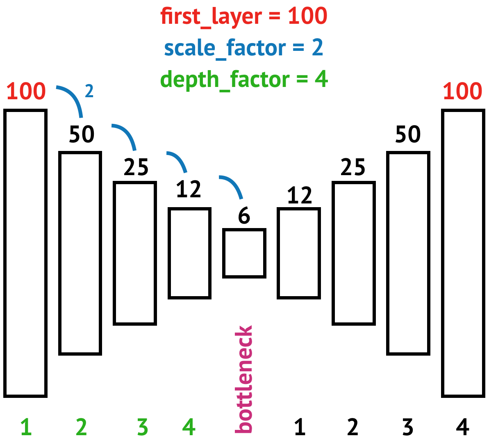
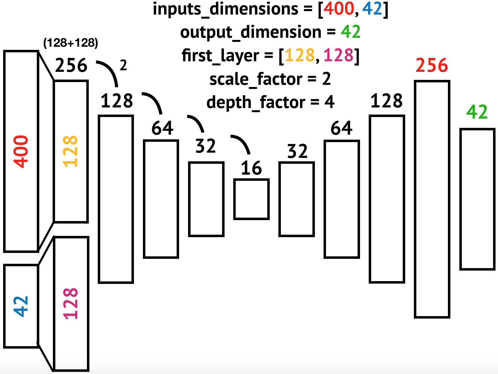

# Генератор автоэнкодеров

Одна глобальная функция (и несколько подфункций), которые конструируют и возвращают модели трёх разных видов автоэнкодеров на базе библиотеки `Keras`.

## Начало работы

Перед началом работы потребуется установить следующие пакеты и библиотеки:
- TensorFlow
- Keras

`TensorFlow` – рекомендуемый бэкэнд для обучения сетей, однако возможно использовать Theano и CNTK.

`Keras` – высокоуровневая абстрактная надстройка над разными бэкэндами.

### Установка

Инструкция по установке `TensorFlow`: https://www.tensorflow.org/install/

Инструкция по установке `Keras`: https://keras.io/#installation

## Использование функции

Для начала, функцию надо импортировать:
```
from autoencoder import autoencoder_generator
```

Использовать функцию можно в трёх режимах, то есть для создания автоэнкодеров следующих архитектур:
1. С одним входом и одним выходом
2. С двумя входами и одним выходом, складывая первые скрытые уровни, отдельные для каждого входа
3. С двумя входами и одним выходом, складывая сразу входные слои

Подробнее – см. по содержанию.
1. [Один вход и один выход](#single_input)
2. [Два входа, один выход, сложение скрытых слоёв](#double_inputs_1)
3. [Два входа, один выход, сложение входных слоёв](#double_inputs_2)

### <a name="single_input">Один вход и один выход</a>

Для того, чтобы создать такой автоэнкодер, нужно при объявлении функции передать следующие параметры:

- `number_of_inputs`, тип: `int`. Это – переключатель, для него возможны только два значения: 1 или 2. Логично, что 1 – это один вход, 2 – это два входа.
- `inputs_dimensions`, тип: `int`. Этот параметр просто показывает, сколько нейронов будет на входном слое.
- `first_layer`, тип: `int`. Этот параметр определяет количество нейронов на первом скрытом слое, который идёт сразу после входного.
- `scale_factor`, тип: `int`. Это – **фактор масштабируемости**. Он показывает, во сколько раз каждый следующий слой будет меньше (в энкодере) или больше (в декодере) предыдущего. **scale_factor > 1**!
- `depth_factor`, тип: `int`. Это – **степень глубины**. Она показывает, сколько слоёв будет до и после `bottleneck`-а. Пример использования этих трех параметров – на рисунке.



- `activation`, тип: `str` или `list`. Этот параметр определяет, какая функция активации (ФА) будет идти после каждого скрытого слоя. Возможно использовать два варианта:
  - Одну строку (`"relu"`). Тогда она автоматически поставится после каждого скрытого слоя.
  - Список функций активации, по длине равный `(depth_factor * 2) + 1` (пример: `["relu"]*((depth_factor*2)+1)`). В таком случае после каждого скрытого слоя будет ставиться соответствующая ФА.
- `optimizer`, тип: `str`. Оптимизатор [для компиляции модели](https://keras.io/optimizers/).
- `loss`, тип: `str`. [Функция ошибки](https://keras.io/losses/) для компиляции модели.
- `metrics`, тип: `list`. Список [метрик качества](https://keras.io/metrics/) обучения для компиляции модели.

Таким образом, создать модель автоэнкодера с одним входом можно следующим образом:
```
model = autoencoder_generator(number_of_inputs = 1,
							  inputs_dimensions = 42,
							  first_layer = 100,
							  scale_factor = 2,
							  depth_factor = 4,
							  activation = "relu",
							  optimizer="adam",
							  loss="mean_squared_error",
							  metrics=["mse"])
```

### <a name="double_inputs_1">Два входа и один выход со сложением скрытых слоёв</a>

Для того, чтобы создать такой автоэнкодер, нужно при объявлении функции передать следующие параметры:

- `number_of_inputs`, тип: `int`. Это – переключатель, для него возможны только два значения: 1 или 2. В данном случае он должен быть 2.
- `concatenate_axis`, тип: `int`. Это второй переключатель. Он может быть `0` или `1`. `0` – складывать (конкатенировать) входные слои, `1` – складывать первые скрытые слои после входных. В данном случае этот параметр должен равняться `1`.
- `inputs_dimensions`, тип: `list`. Этот параметр показывает, сколько нейронов будет на каждом входном слое.
- `output_dimension`, тип: `int`. Это **обязательный параметр**, показывающий, сколько нейронов будет на выходном слое автоэнкодера.
- `first_layer`, тип: `list`. Этот параметр определяет количество нейронов на первом скрытом слое, который идёт сразу после входного. В данном случае после каждого входа идет свой скрытый слой, потом они складываются и следующий слой уже пойдет после одного большого (общего) `first_layer[0]` – размер первого скрытого слоя после первого входа, `first_layer[1]` – размер первого скрытого слоя после второго входа.
- `scale_factor`, тип: `int`. Это – **фактор масштабируемости**. Он показывает, во сколько раз каждый следующий слой будет меньше (в энкодере) или больше (в декодере) предыдущего. **scale_factor > 1**!
- `depth_factor`, тип: `int`. Это – **степень глубины**. Она показывает, сколько слоёв будет до и после `bottleneck`-а. Пример использования этих трех параметров в данном конкретном случае – на рисунке.



- `activation`, тип: `str` или `list with a sublist`. Этот параметр определяет, какая функция активации (ФА) будет идти после каждого скрытого слоя. Возможно использовать два варианта:
  - Одну строку (`"relu"`). Тогда она автоматически поставится после каждого скрытого слоя.
  - Список функций активации, по длине равный `(depth_factor * 2) + 1` и содержащий один подсписок на нулевом индексе (пример: `[["relu", "relu"], "relu", "relu", ..., "relu"]`). В таком случае после каждого скрытого слоя будет ставиться соответствующая ФА. Касательно подписка: `activation[0][0]` – функция активации, которая пойдет после скрытого слоя после первого входа. `activation[0][1]` – функция активации, которая пойдет после скрытого слоя после второго входа.
- `optimizer`, тип: `str`. Оптимизатор [для компиляции модели](https://keras.io/optimizers/).
- `loss`, тип: `str`. [Функция ошибки](https://keras.io/losses/) для компиляции модели.
- `metrics`, тип: `list`. Список [метрик качества](https://keras.io/metrics/) обучения для компиляции модели.

Таким образом, создать модель автоэнкодера с двумя входами можно следующим образом:
```
model = autoencoder_generator(number_of_inputs = 2,
                              concatenate_axis = 1,
                              inputs_dimensions = [400, 42],
                              output_dimension = 42,
                              first_layer = [128, 128],
                              scale_factor = 2,
                              depth_factor = 4,
                              activation = "relu",
                              optimizer="adam",
                              loss="mean_squared_error",
                              metrics=["mse"])
```

### <a name="double_inputs_2">Два входа и один выход со сложением входных слоёв</a>

Для того, чтобы создать такой автоэнкодер, нужно при объявлении функции передать следующие параметры:

- `number_of_inputs`, тип: `int`. Это – переключатель, для него возможны только два значения: 1 или 2. В данном случае он должен быть 2.
- `concatenate_axis`, тип: `int`. Это второй переключатель. Он может быть `0` или `1`. `0` – складывать (конкатенировать) входные слои, `1` – складывать первые скрытые слои после входных. В данном случае этот параметр должен равняться `0`.
- `inputs_dimensions`, тип: `list`. Этот параметр показывает, сколько нейронов будет на каждом входном слое.
- `output_dimension`, тип: `int`. Это **обязательный параметр**, показывающий, сколько нейронов будет на выходном слое автоэнкодера.
- `first_layer`, тип: `int`. Этот параметр определяет количество нейронов на первом скрытом слое, который идёт сразу после входного.
- `scale_factor`, тип: `int`. Это – **фактор масштабируемости**. Он показывает, во сколько раз каждый следующий слой будет меньше (в энкодере) или больше (в декодере) предыдущего. **scale_factor > 1**!
- `depth_factor`, тип: `int`. Это – **степень глубины**. Она показывает, сколько слоёв будет до и после `bottleneck`-а. Пример использования этих трех параметров в данном конкретном случае – на рисунке, то же самое, что и в случае `single_input`-автоэнкодера, только входа два (спасибо, кэп).


- `activation`, тип: `str` или `list`. Этот параметр определяет, какая функция активации (ФА) будет идти после каждого скрытого слоя. Возможно использовать два варианта:
  - Одну строку (`"relu"`). Тогда она автоматически поставится после каждого скрытого слоя.
  - Список функций активации, по длине равный `(depth_factor * 2) + 1` (пример: `["relu"]*((depth_factor*2)+1)`). В таком случае после каждого скрытого слоя будет ставиться соответствующая ФА.
- `optimizer`, тип: `str`. Оптимизатор [для компиляции модели](https://keras.io/optimizers/).
- `loss`, тип: `str`. [Функция ошибки](https://keras.io/losses/) для компиляции модели.
- `metrics`, тип: `list`. Список [метрик качества](https://keras.io/metrics/) обучения для компиляции модели.

Таким образом, создать модель автоэнкодера с двумя входами можно следующим образом:
```
model = autoencoder_generator(number_of_inputs = 2,
							  inputs_dimensions = [400, 42],
							  output_dimension = 42,
							  concatenate_axis = 0,
							  first_layer = 256,
							  scale_factor = 2,
							  depth_factor = 4,
							  activation = "relu",
							  optimizer="adam",
							  loss="mean_squared_error",
							  metrics=["mse"])
```

## TODOs:
- [ ] Поместить все функции активации в один файл и везде его импортировать, чтобы сравнивать ввод с имеющимися ФА в стандартной библиотеке
- [ ] Добавить больше обработчиков исключений
- [ ] Поместить все сообщения об ошибках в один файл и присвоить им кодовые номера, чтобы легче в них ориентироваться
- [ ] Зачем нужно последний слой всегда создавать отдельно?
